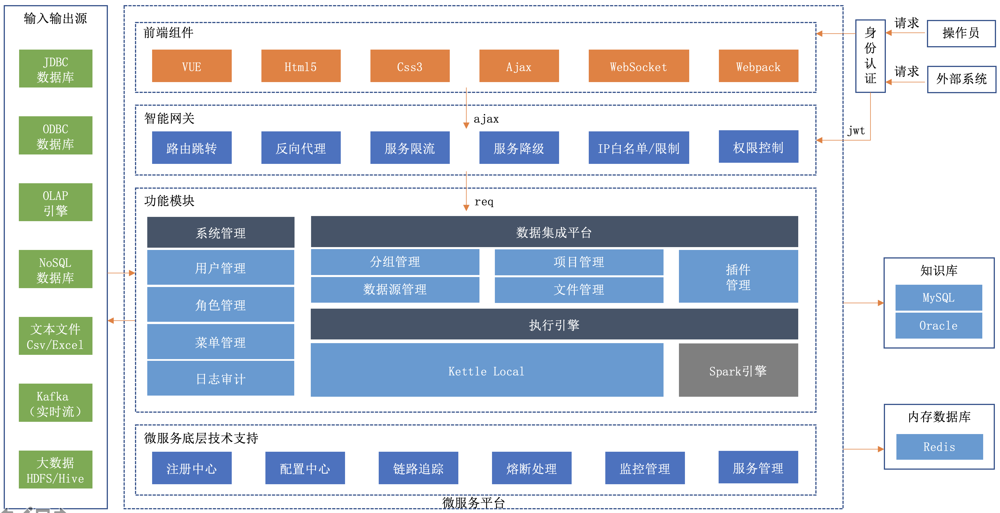
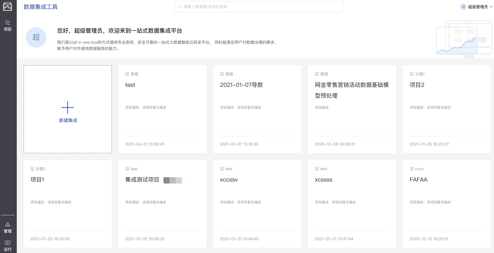
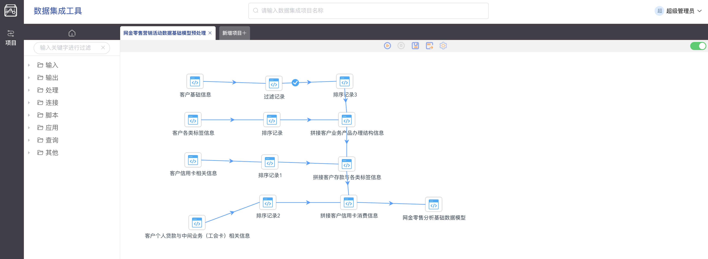
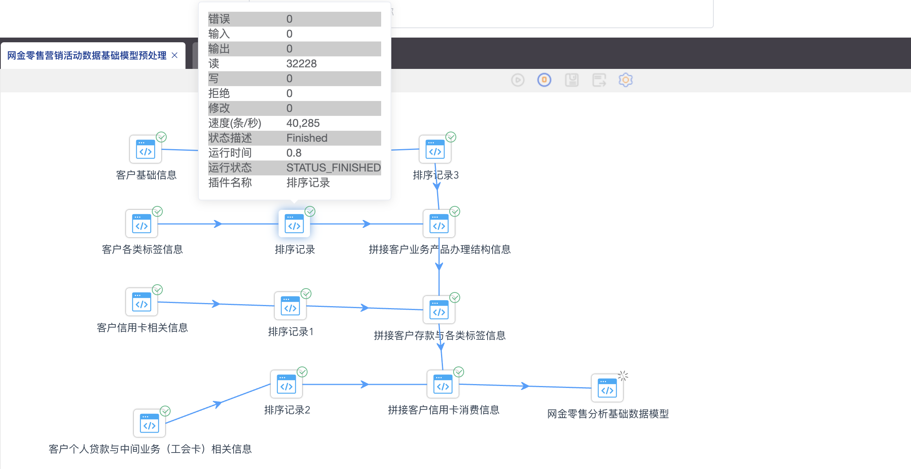
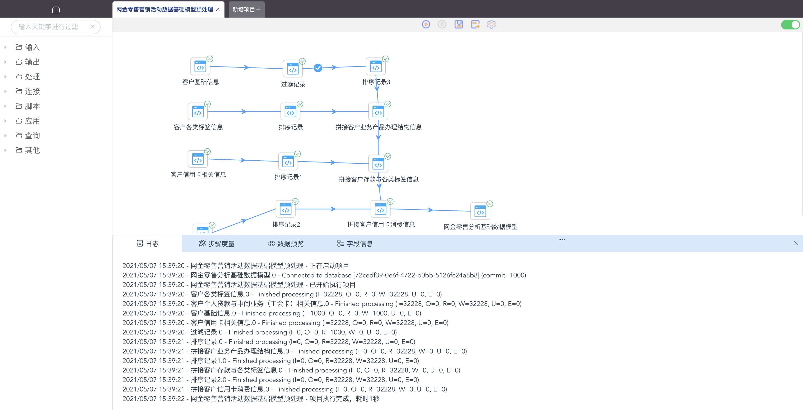

<p align="center">
  <strong>基于kettle的可视化数据集成平台</strong>
</p>

<p align="center">
  <a href="https://github.com/young-datafan/data-integration/blob/develop/README.md">English</a> | 简体中文
</p>

<p align="center">
    <a target="_blank" href="https://github.com/young-datafan/data-integration/blob/develop/LICENSE">
        
    </a>
    <a target="_blank" href="https://www.oracle.com/technetwork/java/javase/downloads/index.html">
        
    </a>
</p>
<br/>

--------------------------------------------------------------------------------

# 架构



--------------------------------------------------------------------------------

# 模块

* dataintegration-common : 公共模块
* dataintegration-group : 分组管理
* dataintegration-project : 脚本管理
* dataintegration-run : 数据集成运行模块
* dataintegration-sso : sso单点登录模块
* dataintegration-sys : 系统管理模块
* dataintegration-vue : 前端vue模块

--------------------------------------------------------------------------------

# 功能特点

* vue2+springCloud架构（后续支持vue3）
* 支持kettle本地引擎，后续扩展spark引擎
* 支持ftp/s3协议的文件读取

--------------------------------------------------------------------------------

# 用户界面截图






--------------------------------------------------------------------------------

# 近期研发计划

TODO

--------------------------------------------------------------------------------

# 参与贡献

非常欢迎大家来参与贡献，贡献流程请参考：
TODO

--------------------------------------------------------------------------------

# 快速试用 Docker

TODO

--------------------------------------------------------------------------------

# 如何构建

```bash
./mvnw clean install
```

--------------------------------------------------------------------------------

# 获得帮助

1. 提交[issue](https://github.com/young-datafan/data-integration/issues)

--------------------------------------------------------------------------------

## 版权

请参考 [LICENSE](https://github.com/young-datafan/data-integration/blob/develop/LICENSE) 文件.

--------------------------------------------------------------------------------
